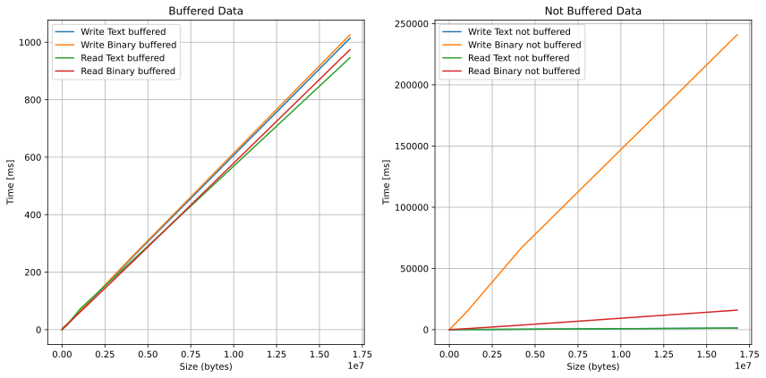
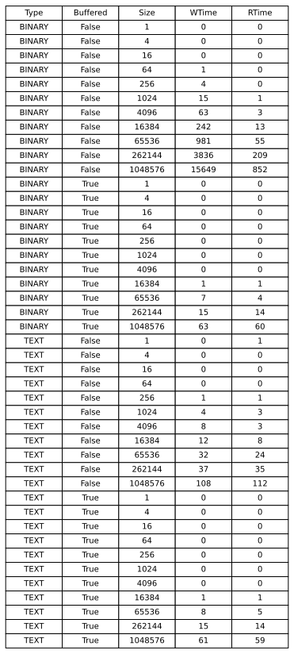

# File I/O Performance Measurement

This Java application measures and compares the performance of reading and writing operations for binary and text files, with and without buffering. It generates a CSV (Comma-Separated Values) file with the results.

## Usage

To run the application, follow these steps:

1. Compile and pack the application.

   ```shell
   ./mvnw package
   ```

2. Execute the program. You can specify two optional command-line arguments: `max power of 2` and `interval`. `max power of 2` determines the maximum file size in bytes (2^maxPower), and `interval` sets the step size between file sizes. If no arguments are provided, default 2<sup>20</sup> and 2 values will be used.

   ```shell
   java -jar target/java-ios-practical-content-1.0-SNAPSHOT.jar <max power of 2> <interval>
   ```

3. The application will perform the following operations for binary and text files, with and without buffering:

   - Write files of various sizes.
   - Read the previously written files.
   - Record the time taken for each operation.

4. A CSV file named `data.csv` will be generated in the current directory. This file contains the following columns:

   - `Name`: File name.
   - `Type`: File type (BINARY or TEXT).
   - `Buffered`: Whether buffering is enabled (true or false).
   - `Size`: File size in bytes.
   - `WTime`: Time taken to write the file (in milliseconds).
   - `RTime`: Time taken to read the file (in milliseconds).

## Example

Here's an example of running the application with custom `maxPower` and `interval` values:

```shell
java -jar target/java-ios-practical-content-1.0-SNAPSHOT.jar 20 2
```

In this example, the application will measure performance for file sizes from 2<sup>0</sup> bytes up to 2<sup>20</sup> bytes (1 megabyte), with a step increment of 2 .

## Generate charts and dataTable

Prerequisites for SVG Generation: `matplotlib` and `pandas`

To generate SVG (Scalable Vector Graphics) files, you will need to install the `matplotlib` and `pandas` Python libraries. You can install them using the following `pip` commands:

```shell
pip install matplotlib
pip install pandas
```

After creating the `data.csv` file, you can use the following commands to create graphs and a data table:

```shell
python chart.py
python dataTable.py
```

These commands will help you visualize and analyze the data generated by the application.

## Note

- The application uses classes and methods from the `ch.heigvd.dai` package for measuring file I/O performance.
- The `isNumber` function checks if a string can be converted to an integer.

Please make sure you have the required dependencies and permissions to run this application.

## Results

With this project, we have generated the following data, ranging from 1 byte to 2<sup>24</sup> bytes (1 byte to 16 megabyte) with an interval of 2. Here are the results:

Here is the results:




From this analysis, we can say that:

1) When buffered it's faster
2) Unbuffered, `TEXT` type processing in reading and writing is not really important.
3) Processing speed of `BINARY` files is considerably faster when buffered.

## Conclusion

#### Which type of stream is the most efficient for each use case?

Binary streams are the most efficient for all use cases, regardless of whether or not buffering is enabled.

#### Why is it more efficient than the other types of streams?

Binary streams are more efficient because they operate directly on bytes, without having to perform any encoding or decoding. This is especially important when dealing with large amounts of data.

Text streams, on the other hand, must encode and decode the data each time it is read or written. This can add a significant overhead, especially when dealing with large files.

#### What is the difference between binary data and text data?

Binary data is data that is stored in its native format, without any encoding or decoding. This is the most efficient way to store data, but it is not human-readable.

Text data, on the other hand, is data that has been encoded to make it human-readable. This is less efficient than storing binary data, but it is much easier to read and write.

#### What is a character encoding?

A character encoding is a way of representing characters as a sequence of bytes. There are many different character encodings, each with its own advantages and disadvantages.

The most common character encoding is ASCII, which uses 7 bits to represent each character. This allows ASCII to represent 128 different characters, including all of the letters, numbers, and punctuation symbols that are commonly used in English.

However, ASCII cannot represent all of the characters that are used in other languages. For example, it cannot represent the characters that are used in Chinese, Japanese, or Korean.

To represent these characters, other character encodings are used, such as UTF-8. UTF-8 uses a variable number of bytes to represent each character, which allows it to represent a much wider range of characters than ASCII.

#### Why is this methodology important?

It is important to understand the difference between binary and text streams, and to choose the right type of stream for each use case. This can help to improve the performance and efficiency of your application.

For example, if you are storing data that does not need to be human-readable, such as images or audio files, you should use a binary stream. This will allow you to store the data in the most efficient way possible.

However, if you are storing data that needs to be human-readable, such as text files or configuration files, you should use a text stream. This will make the data easier to read and write.

In addition to choosing the right type of stream, it is also important to consider whether or not to enable buffering. Buffering can improve the performance of your application by reducing the number of times that the underlying I/O system needs to be accessed.

However, buffering can also add a small overhead, so it is important to weigh the benefits and drawbacks before enabling it.

Overall, understanding the difference between binary and text streams, and choosing the right type of stream for each use case, is an important part of writing efficient Java code.

*information search assistance: Bard text-based IA Google*