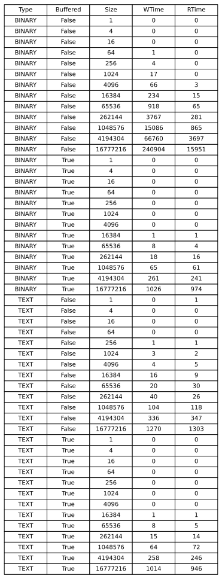

# File I/O Performance Measurement

This Java application measures and compares the performance of reading and writing operations for binary and text files, with and without buffering. It generates a CSV (Comma-Separated Values) file with the results.

## Usage

To run the application, follow these steps:

1. Compile and pack the application.

   ```shell
   ./mvnw package
   ```

2. Execute the program. You can specify two optional command-line arguments: `max power of 2` and `interval`. `max power of 2` determines the maximum file size in bytes (2^maxPower), and `interval` sets the step size between file sizes. If no arguments are provided, default 2<sup>20</sup> and 2 values will be used.

   ```shell
   java -jar target/java-ios-practical-content-1.0-SNAPSHOT.jar <max power of 2> <interval>
   ```

3. The application will perform the following operations for binary and text files, with and without buffering:

   - Write files of various sizes.
   - Read the previously written files.
   - Record the time taken for each operation.

4. A CSV file named `data.csv` will be generated in the current directory. This file contains the following columns:

   - `Name`: File name.
   - `Type`: File type (BINARY or TEXT).
   - `Buffered`: Whether buffering is enabled (true or false).
   - `Size`: File size in bytes.
   - `WTime`: Time taken to write the file (in milliseconds).
   - `RTime`: Time taken to read the file (in milliseconds).

## Example

Here's an example of running the application with custom `maxPower` and `interval` values:

```shell
java -jar target/java-ios-practical-content-1.0-SNAPSHOT.jar 20 2
```

In this example, the application will measure performance for file sizes from 2<sup>0</sup> bytes up to 2<sup>20</sup> bytes (1 megabyte), with a step increment of 2 .

## Generate charts and dataTable

Prerequisites for SVG Generation: `matplotlib` and `pandas`

To generate SVG (Scalable Vector Graphics) files, you will need to install the `matplotlib` and `pandas` Python libraries. You can install them using the following `pip` commands:

```shell
pip install matplotlib
pip install pandas
```

After creating the `data.csv` file, you can use the following commands to create graphs and a data table:

```shell
python chart.py
python dataTable.py
```

These commands will help you visualize and analyze the data generated by the application.

## Note

- The application uses classes and methods from the `ch.heigvd.dai` package for measuring file I/O performance.
- The `isNumber` function checks if a string can be converted to an integer.

Please make sure you have the required dependencies and permissions to run this application.

## Exemple of generated datas and charts

With this project, we have generated the following data, ranging from 1 byte to 2<sup>20</sup> bytes (1 megabyte) with an interval of 2. Here are the results:


